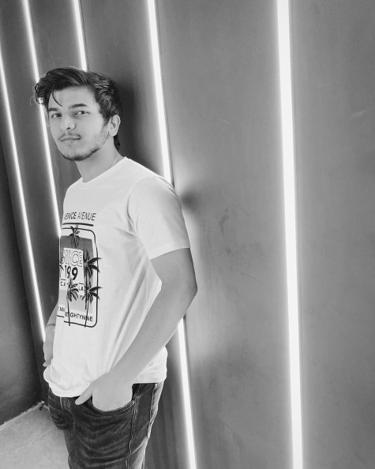
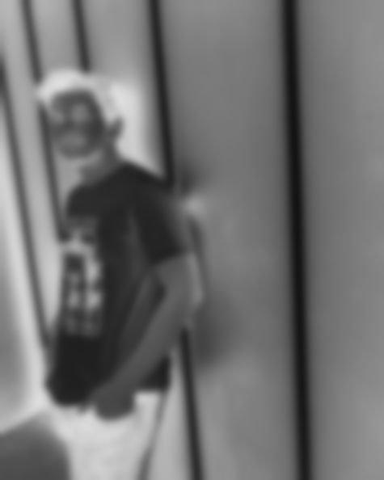
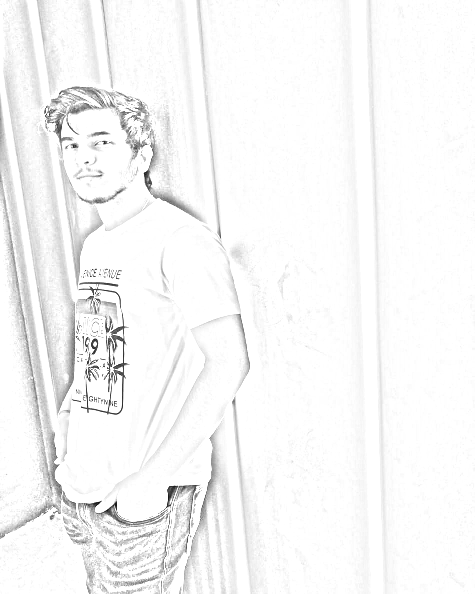

It is a very very simple sketch generation python script which uses OpenCV.

This is done is simple 5 steps-
1. Import image

2. Convert it to Grayscale

3. Invert the image using Bitwise_Not

4. Using Gaussian_Blur to remove high-frequency components

5. Implementing dodging for getting the final output.

